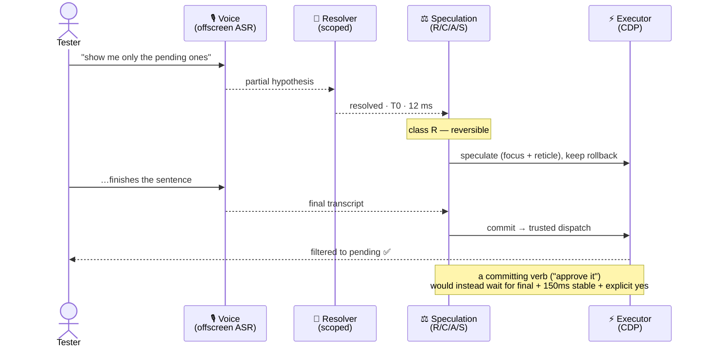
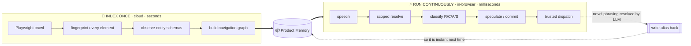
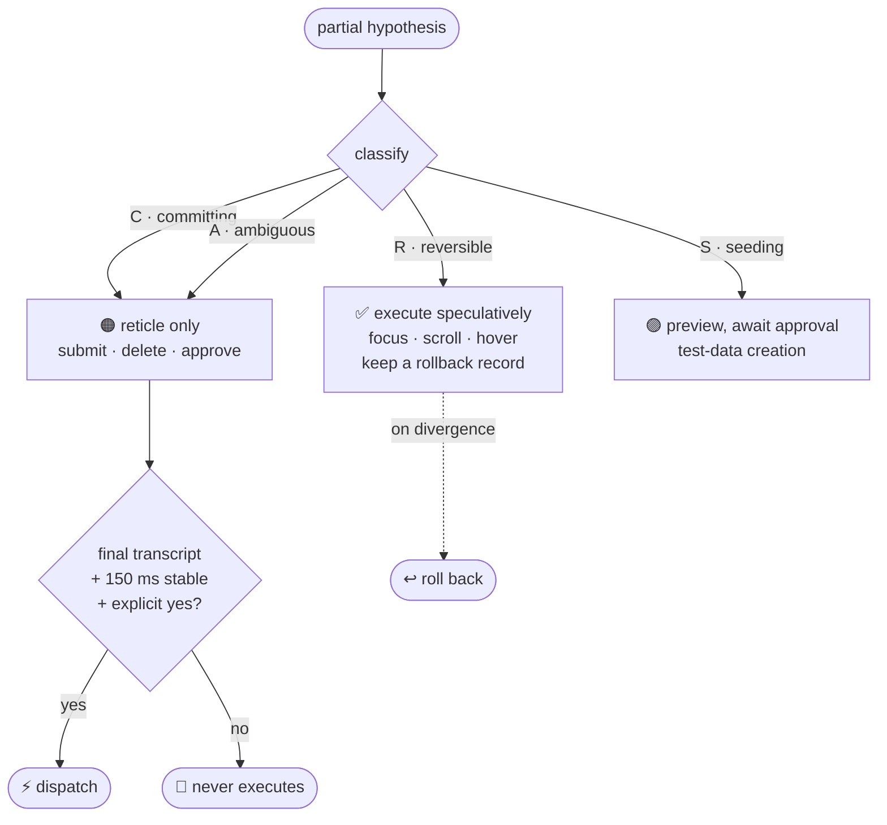
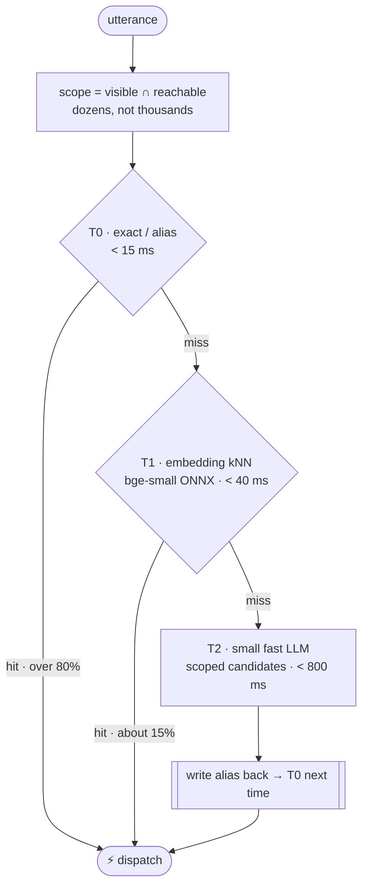
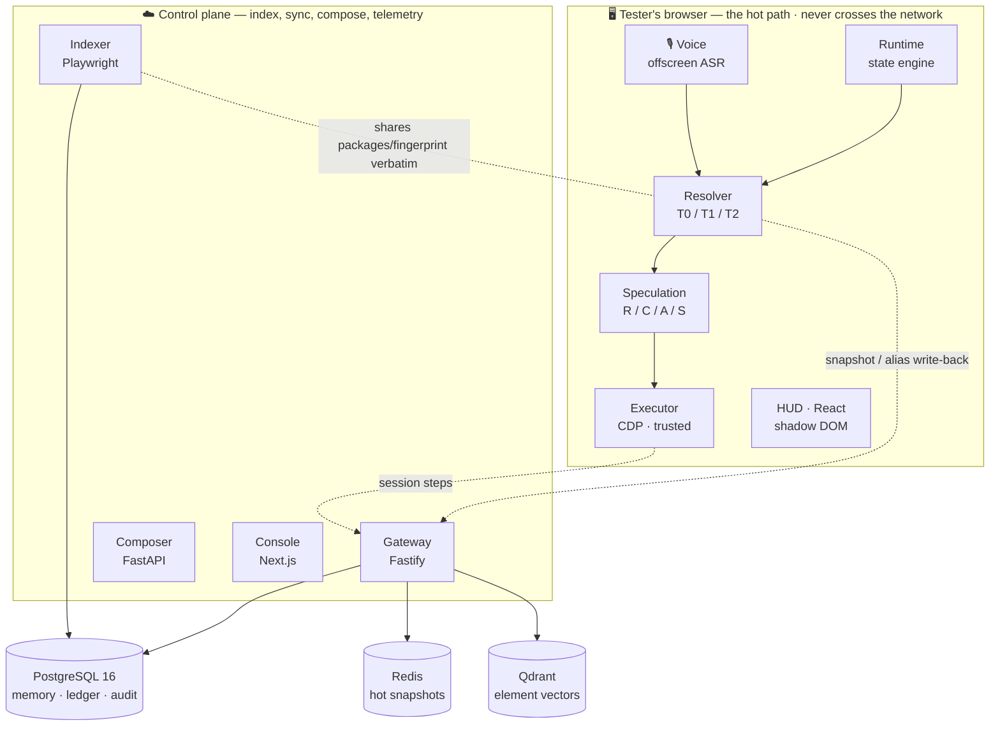
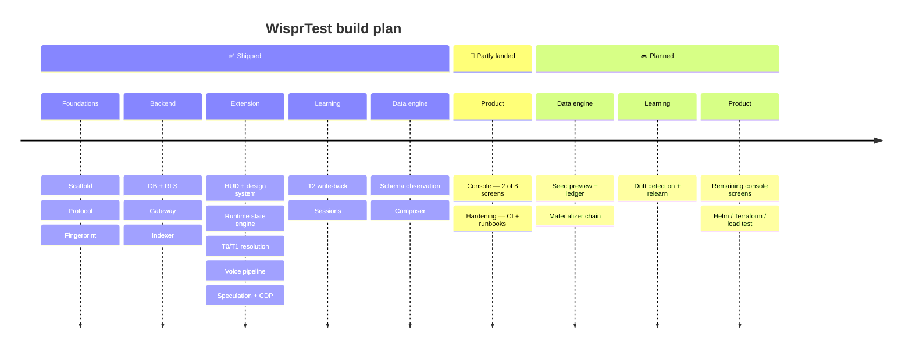

<div align="center">

<picture>
  <source media="(prefers-color-scheme: dark)" srcset="docs/media/logo-lockup-dark.svg" />
  
</picture>

<h3>A voice-native execution layer for manual QA of enterprise web apps.</h3>

<p><em>Name your app. It indexes once. Then you just talk — and it executes against the live DOM in under a second.</em></p>


<br/>


<br/>


<br/><br/>

<a href="#-see-it-in-action"><b>See it in action</b></a> ·
<a href="#-the-thesis"><b>The thesis</b></a> ·
<a href="#-safety--speed"><b>Safety &amp; speed</b></a> ·
<a href="#-getting-started"><b>Getting started</b></a> ·
<a href="docs/ARCHITECTURE.md"><b>Architecture</b></a>

</div>

---

A tester narrates what they are doing —

> _"open orders"_ … _"show me only the pending ones"_ … _"I need a pending order for Acme
> with three line items"_ … _"approve it"_

— and WisprTest resolves each phrase against the live DOM and dispatches a **trusted**
event in milliseconds, generating any test data the flow needs along the way.

**This is not** a chatbot, a test recorder, an autonomous agent, or an RPA tool. It does
not _figure out_ your app at runtime — it **remembers** it.

---

## 🎬 See it in action

> **Demo screencast slot** — drop a real capture here once recorded.
> Suggested: `docs/media/demo.gif` (a 10–15s loop of the four commands above driving a
> real app), embedded as ``.
>
> <!--  -->

Until then, here is the exact runtime path a single sentence travels — **on-page, no
network hop:**



---

## 💡 The thesis

<div align="center">
<h3><code>Think → Execute</code> &nbsp;becomes&nbsp; <code>Remember → Execute</code></h3>
</div>

Expensive reasoning happens **once**, during indexing. Runtime is a lookup-and-dispatch
problem measured in **milliseconds**, not a reasoning problem measured in seconds.



The crawler does the hard thinking up front and writes it into **Product Memory**. When
the runtime _does_ have to reason — a phrasing it has never heard — it writes the answer
back as an alias, so the same words are an instant lookup next time. **That write-back
loop is the product's compounding asset.**

---

## 🛡️ Safety & speed

### 1 · The reversibility taxonomy — safety

Every action is classified, and the class decides whether the runtime may act on a
_partial_ speech hypothesis before you have finished the sentence.



|       Class        | Meaning                                      |     Speculative?      | Confirmation                   |
| :----------------: | -------------------------------------------- | :-------------------: | ------------------------------ |
| **R** — Reversible | focus, hover, scroll, expand, read-only nav  | **Yes**, on a partial | No                             |
| **C** — Committing | submit, delete, approve — any state mutation |       **Never**       | Yes — final + explicit _yes_   |
| **A** — Ambiguous  | resolver confidence below threshold          |    Pre-stage only     | Yes                            |
|  **S** — Seeding   | test-data creation                           |       **Never**       | Yes — preview before any write |

> ⚠️ Speculating on a Class **C** action is the single worst bug this product can have. A
> confident wrong click costs more trust than any latency win gains. A release-gate test
> proves a Class C action is **never** executed from a partial — even when the partial and
> final transcripts are byte-for-byte identical.

### 2 · Scoped, tiered resolution — speed

The runtime state engine narrows candidates from thousands of DOM nodes to the **dozens
currently visible and reachable**, then resolves in tiers — escalating only when it must.



### Performance budgets — enforced as tests, not aspirations

| Metric                                            |          Budget           |
| ------------------------------------------------- | :-----------------------: |
| Speech onset → reticle rendered (p95)             |       **< 400 ms**        |
| T0 resolution (p99)                               |        **< 15 ms**        |
| Action dispatch after commit (p95)                |        **< 30 ms**        |
| Scope recompute after mutation burst (3000 nodes) |        **< 8 ms**         |
| Indexer throughput                                |    **> 8 routes/min**     |
| **False execution rate**                          | **< 0.1% — release gate** |

Latency regressions cost satisfaction; false executions cost the account. Benchmarks fail
the build on regression.

---

## 🏗️ Architecture at a glance



Full system map, data model, and per-service responsibilities:
[`docs/ARCHITECTURE.md`](docs/ARCHITECTURE.md).

---

## 📂 Repository layout

```
wisprtest/
├── CLAUDE.md                  ← engineering rules & product contract (read first)
├── docs/
│   ├── ARCHITECTURE.md        ← system map, boundaries, data model
│   ├── TEST-DATA-ENGINE.md    ← generic vs per-app split, adapters
│   ├── BUILD-PLAN.md          ← phased prompts, in order
│   ├── adr/                   ← decision log: what was decided, and what it cost
│   └── runbooks/              ← drift backlog, indexer failure, ASR outage, seed failure
├── packages/
│   ├── protocol/              ← Zod schemas + derived TS types (the contract)
│   ├── fingerprint/           ← element fingerprinting + scoring resolver (SHARED verbatim)
│   └── ui/                    ← design tokens + HUD primitives
├── apps/
│   ├── extension/             ← MV3 Chrome extension: runtime, HUD, voice, executor
│   ├── console/               ← Next.js web console
│   ├── gateway/               ← Fastify: API, auth, tenancy, memory CRUD
│   ├── indexer/               ← Node + Playwright: crawl, fingerprint, observe schemas
│   └── composer/              ← FastAPI: schema inference, constraint solve, compose
├── db/                        ← SQL migrations (Atlas), seed fixtures
└── infra/                     ← Docker, Helm, Terraform (Phase 19 — not yet populated)
```

### Stack

| Layer         | Choice                                                           | Why                                                                           |
| ------------- | ---------------------------------------------------------------- | ----------------------------------------------------------------------------- |
| Runtime       | Chrome MV3 extension, TypeScript                                 | Hot path must be in-process with the DOM — no network hop                     |
| Indexer       | Node + Playwright                                                | Shares `packages/fingerprint` with the extension — one implementation         |
| Gateway       | Fastify + TypeScript                                             | Type sharing with the protocol package; low overhead                          |
| Composer      | FastAPI + Python                                                 | Constraint solving and distribution sampling are cleaner in Python            |
| Console       | Next.js App Router, Tailwind, shadcn/ui, Zustand, TanStack Query | House standard                                                                |
| Primary store | PostgreSQL 16                                                    | Memory graph, schemas, ledger, sessions, audit — every row `tenant_id`-scoped |
| Vector        | Qdrant                                                           | Embedding search over scoped candidates + alias corpus                        |
| Cache         | Redis                                                            | Hot memory snapshots per `(tenant, app, version)`                             |
| Object store  | MinIO (S3-compatible)                                            | Session evidence — screenshots and DOM snapshots, retrieved by signed URL     |
| Observability | OpenTelemetry → Prometheus / Grafana / Loki                      | Mandatory per service                                                         |
| Orchestration | Docker Compose                                                   | `make dev` brings up everything                                               |

---

## 🚀 Getting started

### Prerequisites

- **Node ≥ 22** and **pnpm** (`corepack enable` picks up the pinned version)
- **Python** with [**uv**](https://docs.astral.sh/uv/) (for `apps/composer`)
- **Docker** + Docker Compose (Postgres 16, Redis 7, Qdrant, MinIO)
- [**Atlas**](https://atlasgo.io/) for database migrations
- Google **Chrome** (the extension loads unpacked; e2e uses system Chromium)

### First run

```bash
pnpm install                # 1. install workspace dependencies
cp .env.example .env        # 2. create your local env file, then fill it in
make db-up                  # 3. bring up Postgres / Redis / Qdrant / MinIO (waits for healthy)
make db-reset               # 4. create the schema + load the test fixture
make dev                    # 5. run every service in watch mode
```

### Load the extension

1. `pnpm --filter extension build`
2. Chrome → `chrome://extensions` → enable **Developer mode** → **Load unpacked**
3. Select `apps/extension/dist`

<details>
<summary><b>Handy Make targets</b></summary>

```bash
make help          # list all targets
make dev           # infra + all services in watch mode
make build         # regenerate contract/schema types, then build every package
make test          # every workspace test suite
make lint          # ESLint + Prettier + ruff
make typecheck     # tsc --noEmit across TS, mypy --strict for composer
make db-up         # start Postgres / Redis / Qdrant / MinIO
make db-migrate    # apply Atlas migrations
make db-reset      # drop, recreate, migrate, seed (destructive; Compose DB only)
```

</details>

---

## 🧪 Testing

Tests are part of the deliverable — unit tests for resolvers and composers, integration
tests for adapters, and Playwright e2e for the runtime loop.

```bash
pnpm test                                        # everything
pnpm --filter fingerprint test -- --coverage     # scoring + resolve (≥90%)
pnpm --filter indexer test:e2e                   # crawl the fixture app, assert memory
pnpm --filter extension test:resolver            # T0/T1 resolution
pnpm --filter extension test:voice               # voice pipeline (scripted ASR fixture)
pnpm --filter extension test:speculation         # reversibility taxonomy + executor
pnpm --filter extension test:e2e:command         # real trusted CDP dispatch in Chromium
pnpm --filter extension bench:speech-to-reticle  # p95 < 400 ms gate
pnpm --filter extension bench:scope              # scope recompute < 8 ms gate
pnpm --filter console test                       # console: crawl bounds, SSE, auth, routes
```

The composer is Python and runs under `uv`, with its 90% coverage gate wired into pytest:

```bash
cd apps/composer && uv run mypy --strict src && uv run pytest -q
```

---

## 📈 Build progress

Built in the phased order defined in [`docs/BUILD-PLAN.md`](docs/BUILD-PLAN.md).
**Phases 0–14 shipped; 18 and 19 partially landed.**



|   #   | Phase                                                  |         Status          |
| :---: | ------------------------------------------------------ | :---------------------: |
|  0–2  | Scaffold · Protocol · Fingerprint                      |           ✅            |
|  3–5  | DB + RLS · Gateway · Indexer                           |           ✅            |
|  6–7  | Extension shell + HUD · Runtime state engine           |           ✅            |
| 8–10  | T0/T1 resolution · Voice · Speculation + CDP execution |           ✅            |
| 11–13 | T2 write-back · Sessions · Schema observation          |           ✅            |
|  14   | Composer — contract, sampler, solver, provenance DAG   |           ✅            |
| 15–17 | Seed preview + ledger · Materializers · Drift          |       ⬜ planned        |
|  18   | Console — Connect + Indexing screens                   |    🚧 2 of 8 screens    |
|  19   | Production hardening — CI + runbooks landed early      | 🚧 `infra/` still empty |

> **Phase 18** is a deliberate slice: Connect (crawl bounds + start) and Indexing (live SSE
> progress) are built and tested, so an application can be indexed without touching a
> terminal. The other six screens depend on Phases 15 and 17 and are not started.
>
> **Phase 19** landed out of order — the CI pipeline and all four operational runbooks are
> in, while the Helm charts, Terraform, Grafana dashboards and load test are not.

Since Phase 14 the unit of work is a **track**, not a phase — one owner, one module, one
branch, one PR, several running concurrently. See [ADR 0012](docs/adr/0012-parallel-tracks.md)
for why, and what it cost.

---

## 📐 Engineering rules (the short version)

Non-negotiable and enforced in review. Full list in [`CLAUDE.md`](CLAUDE.md).

1. **No placeholders.** No `TODO`, no mock returns — an honest refusal beats a stub.
2. **The hot path never crosses the network.**
3. **Contracts before code.** Zod schemas in `packages/protocol` first; types are _derived_.
4. **Fingerprint logic has exactly one implementation** — shared verbatim by extension and indexer.
5. **Every mutation of the app under test is reversible or gated** (the taxonomy above).
6. **Every service ships with logging, metrics, tracing, and a health check** — as a definition of done.
7. **Multi-tenant from line one.** Every table has `tenant_id`; every query is scoped.
8. **Typed end to end.** TS `strict`, Python `mypy --strict`. No `any`, no bare `dict`.
9. **Tests are part of the deliverable.**
10. **Never commit secrets.** Config from env, validated at boot.

<details>
<summary><b>Generic vs per-application</b> — the distinction that governs the whole codebase</summary>

The crawler, fingerprinting, resolver, runtime engine, voice pipeline, executor, HUD,
schema inference, constraint solver, and adapter _interfaces_ are **generic** — written
once, work for every customer app. Element fingerprints, navigation graphs, entity
schemas, value distributions, enum vocabularies, and the alias corpus are
**per-application** — learned or configured, never hardcoded. If you ever write
`if (app === 'northstar')`, stop: that value belongs in the per-application memory record,
loaded at runtime.
</details>

### 🔒 PII rule

Product Memory stores **structure**, never **content**. Accessible names are extracted,
scrubbed through the redaction pipeline, and only then persisted or placed in a prompt. A
table of customer names must never reach memory or an LLM request. This is a procurement
blocker, not a nice-to-have.

---

## 📚 Documentation

| Document                                               | What's in it                                                      |
| ------------------------------------------------------ | ----------------------------------------------------------------- |
| [`CLAUDE.md`](CLAUDE.md)                               | Product contract, engineering rules, taxonomy, budgets            |
| [`docs/ARCHITECTURE.md`](docs/ARCHITECTURE.md)         | System map, boundaries, extension internals, data model, security |
| [`docs/TEST-DATA-ENGINE.md`](docs/TEST-DATA-ENGINE.md) | Generic vs per-app data engine, adapters, composition             |
| [`docs/BUILD-PLAN.md`](docs/BUILD-PLAN.md)             | The phased build plan, in order                                   |

---

<div align="center">
<sub>Proprietary — all rights reserved. · <code>Remember → Execute</code></sub>
</div>
