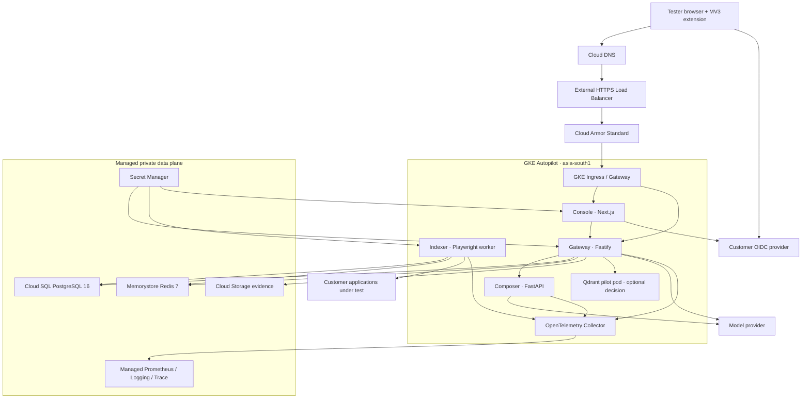

# WisprTest — GCP production deployment plan

This is the deployment blueprint for a **low-cost production pilot** in Google Cloud,
not a claim that the infrastructure already exists.

- **Target:** up to approximately 50 active testers
- **Primary region:** Mumbai, India (`asia-south1`)
- **Availability posture:** single-region, limited HA for the pilot
- **Currency:** USD
- **Pricing checked:** 2026-08-30
- **Implemented today:** Dockerfiles and kind-first Helm charts
- **Not implemented today:** Terraform, GCP overlays, ingress, cloud secret projection,
  production OIDC, collector, alert rules, extension store packaging

Read [`STATUS.md`](STATUS.md) before executing this plan. The existing kind deployment
remains documented in [`runbooks/deploy.md`](runbooks/deploy.md).

---

## 1. Executive recommendation

Use **GKE Autopilot** for the four existing control-plane containers. It is not the
absolute cheapest way to host four HTTP processes, but it is the lowest-risk pilot path
because:

1. the repository already has a Helm umbrella, probes, security contexts, PDBs, HPAs,
   and graceful-shutdown settings;
2. the indexer is a long-running Redis Streams worker with Playwright Chromium, a
   2 GiB `/dev/shm`, and a 90-second drain window — it does not map cleanly to an
   on-demand request platform;
3. putting only the indexer on Kubernetes and the other three services on Cloud Run
   would create and operate two deployment systems before the product has 50 testers.

Use managed data services:

- Cloud SQL for PostgreSQL 16, zonal Enterprise edition, private IP, PITR;
- Memorystore for Redis 7, Basic 1 GiB;
- regional Cloud Storage for evidence through its S3-compatible XML API;
- Secret Manager plus a Kubernetes secret-projection controller;
- Managed Service for Prometheus, Cloud Logging, and Cloud Trace through an OTel
  Collector.

Expose two HTTPS origins:

- `console.<domain>` → console;
- `api.<domain>` → gateway, required by the browser extension for control-plane calls.

Composer and indexer remain cluster-internal. Dex remains local-only; production uses
the customer's OIDC provider.

### Pilot trade-off

The recommended pilot is **not zone-failure tolerant** at the database/cache layer.
Cloud SQL zonal and Memorystore Basic can require restore or recreation after a zonal
failure. The upgrade path in [Section 14](#14-ha-and-scale-upgrade-path) moves both to
managed HA and raises minimum app replicas.

---

## 2. What exists in the repository

### Reusable without redesign

| Component | Existing source | Reuse |
|-----------|-----------------|-------|
| Gateway image | `apps/gateway/Dockerfile` | Push to Artifact Registry |
| Indexer image | `apps/indexer/Dockerfile` | Playwright image; validate sandbox on Autopilot |
| Composer image | `apps/composer/Dockerfile` | Push unchanged |
| Console image | `apps/console/Dockerfile` | Build with production URLs/config |
| Helm umbrella | `infra/helm/wisprtest/` | Add a GCP values overlay and ingress |
| Migrations | `db/migrations/` | Run with Atlas as a one-shot release job |
| Health probes | Four Helm subcharts | Keep paths and timings |
| Evidence client | `apps/gateway/src/storage/s3-evidence-store.ts` | Point AWS SDK at GCS XML API |
| Operational gates | `make bench`, `make load-test`, `make security-audit` | Required before promotion |

### Current service requests

These requests are the basis of the compute estimate.

| Service | Minimum replicas | CPU request | Memory request | Maximum replicas |
|---------|------------------|-------------|----------------|------------------|
| gateway | 1 | 250m | 256 MiB | 3 |
| indexer | 1 | 500m | 1 GiB | 2 |
| composer | 1 | 250m | 256 MiB | 3 |
| console | 1 | 250m | 256 MiB | 3 |
| **Total at minimum** | **4 pods** | **1.25 vCPU** | **1.75 GiB** | — |

Autopilot can raise requests to satisfy its minimums and CPU-to-memory ratios. Inspect
the admitted pod requests after deployment; billing follows the admitted requests, not
only the values committed here.

---

## 3. Target architecture



The extension hot path remains in-browser:

`speech → scope → resolve → classify → dispatch`

Gateway traffic is for boot, memory sync, T2, alias write-back, sessions, seeding, and
telemetry. It must never be inserted into the speech-to-dispatch hot path.

---

## 4. GCP resource map

| WisprTest need | Pilot GCP service | Production note |
|----------------|-------------------|-----------------|
| Container orchestration | GKE Autopilot regional cluster | Existing Helm path |
| Images | Artifact Registry, Docker repository in `asia-south1` | Immutable digest promotion |
| PostgreSQL 16 | Cloud SQL Enterprise, `db-custom-1-3840`, zonal | Private IP, PITR, deletion protection |
| Redis 7 | Memorystore Basic, 1 GiB | AUTH/TLS where client compatibility is proven |
| Evidence bytes | Cloud Storage Standard, regional | Uniform bucket access, lifecycle rules |
| Config secrets | Secret Manager | Workload Identity; no service-account keys |
| Crawl credentials | Secret Manager + External Secrets / Secrets Store CSI | Tenant directories under `INDEXER_SECRET_ROOT` |
| Public entry | External Application Load Balancer | Managed certificate, HTTP→HTTPS |
| DNS | Cloud DNS | DNSSEC recommended |
| WAF/rate edge | Cloud Armor Standard | Gateway still retains Redis-backed tenant limits |
| Outbound internet | Cloud NAT | Required for customer apps and model provider |
| Metrics | Managed Service for Prometheus | OTel collector filters cardinality |
| Logs/traces | Cloud Logging and Cloud Trace | PII redaction remains in application |
| OIDC | Existing customer IdP | Dex is not a production dependency |
| Qdrant | Decision: single pod + persistent disk, or remove readiness dependency | No product code uses it today |

---

## 5. Project and environment layout

For the pilot, use three projects under one billing account:

| Project | Purpose |
|---------|---------|
| `wispr-bootstrap` | Terraform state bucket, CI Workload Identity pool/provider |
| `wispr-nonprod` | Dev/staging GKE and managed services |
| `wispr-prod` | Pilot production resources and production secrets |

Do not put production and non-production databases in the same project or VPC. A
mistyped Terraform workspace or IAM binding must not be enough to expose production.

Recommended labels on every resource:

```text
application=wisprtest
environment=prod
owner=platform
data_classification=customer-confidential
managed_by=terraform
region=asia-south1
```

Set billing budgets at 50%, 80%, and 100% of the approved monthly envelope. Budgets are
notifications, not hard stops; also create service quotas for expensive resources.

---

## 6. Network, DNS, and ingress

### VPC

Create one custom-mode VPC per environment:

- GKE pod/service secondary ranges sized for growth;
- private services access range for Cloud SQL and Memorystore;
- Private Google Access on GKE subnets;
- Cloud Router and Cloud NAT in `asia-south1`;
- default-deny Kubernetes NetworkPolicies, then explicit service flows.

No pod receives a public IP. Do not authorize `0.0.0.0/0` on PostgreSQL or Redis.

### Ingress

Use a global external HTTPS load balancer with a Google-managed certificate:

| Host | Backend | Public methods |
|------|---------|----------------|
| `console.<domain>` | console service :3000 | Browser UI, OIDC callback, health |
| `api.<domain>` | gateway service :8080 | Versioned API, gateway health |

Keep composer :8090 and indexer :8081 internal. Health checks use:

- gateway: `/healthz`, `/readyz`;
- console: `/api/healthz`, `/api/readyz`;
- composer: `/healthz`, `/readyz`;
- indexer: `/healthz`, `/readyz`.

Attach Cloud Armor Standard with:

- preconfigured OWASP rules in preview first;
- rate-based bans for obvious abuse;
- geographic policy only if contractually justified;
- explicit OIDC callback allowance;
- request logging with sampled bodies disabled.

The gateway's Redis-backed, tenant-scoped rate limiter remains authoritative. Edge
limits are defense in depth, not a replacement.

### TLS and browser origins

- TLS 1.2+; redirect port 80 to 443.
- HSTS after the first successful production auth flow.
- `OIDC_REDIRECT_URI=https://console.<domain>/auth/callback`.
- Build the extension with production `--gateway-origin` and `--console-origin`.
- Add only those origins to extension host permissions and CSP.
- Register exact redirect/logout URLs at the production IdP.

---

## 7. Identity and IAM

### Human access

Use Google Groups or equivalent IdP groups:

| Group | GCP role intent |
|-------|-----------------|
| `wispr-platform-admins` | Infrastructure administration; time-bound elevation |
| `wispr-deployers` | Release promotion, no secret-value read |
| `wispr-operators` | Read workloads/logs/metrics; run approved operations |
| `wispr-security` | Audit, findings, Binary Authorization policy |
| `wispr-billing` | Billing view and budgets |

Do not grant primitive Owner/Editor roles to users or CI.

### Workload identities

Use one Kubernetes service account and one Google service account per workload:

- `gateway`: evidence bucket object operations, required secret versions, telemetry
  write;
- `indexer`: tenant crawl secret projection, telemetry write;
- `composer`: model secret, telemetry write;
- `console`: OIDC/session secret, telemetry write;
- `otel-collector`: metrics/logs/traces write;
- `db-migrate`: Cloud SQL connect + migration secret, invoked only by release workflow.

Bind with GKE Workload Identity Federation. Do not create downloadable service-account
JSON keys.

### GitHub Actions

Create a Workload Identity Pool provider restricted to:

- this GitHub repository;
- protected `main` or an approved release environment;
- expected workflow/ref claims.

CI may push images and update a release manifest. Production deploy requires GitHub
Environment approval. Terraform plan and apply use separate identities; apply is
approval-gated.

---

## 8. Secrets and runtime configuration

Every configuration key is validated at boot. The canonical inventory is
`.env.example`; production values come from ConfigMaps or Secret Manager.

### Secret Manager

Store at minimum:

- PostgreSQL application and migration credentials;
- Redis AUTH/TLS material if enabled;
- Cloud Storage HMAC access ID and secret;
- `EXTENSION_TOKEN_SIGNING_KEY`;
- `CONSOLE_SESSION_SECRET`;
- OIDC client secret when the provider requires one;
- `MODEL_API_KEY`;
- per-tenant crawl credentials.

Destroy superseded secret versions after the rollback window. Enabled historical
versions continue to incur cost and expand the blast radius.

### Tenant crawl credentials

The indexer currently expects:

```text
INDEXER_SECRET_ROOT/<tenant-uuid>/...
```

The current Helm chart mounts an `emptyDir`, which is not a production secret source.
Before pilot:

1. install External Secrets Operator or Secrets Store CSI Driver;
2. map each tenant's Secret Manager entries into its own directory;
3. set `INDEXER_SECRET_ROOT=/var/wispr/secrets`;
4. deny the indexer service account access to secrets outside the expected prefix;
5. test cross-tenant lookup rejection.

Do not place customer credentials in one flat Kubernetes Secret or environment block.

---

## 9. Data services

### Cloud SQL PostgreSQL 16

Pilot configuration:

- Enterprise edition, PostgreSQL 16;
- `db-custom-1-3840` (1 vCPU, 3.75 GiB);
- zonal instance in `asia-south1`;
- private IP only;
- 50 GiB SSD with automatic storage increase;
- automated daily backups;
- PITR enabled with seven-day log retention;
- deletion protection in Terraform and at the service;
- maintenance window outside customer test hours;
- Query Insights with conservative sampling and no query parameters in logs.

Set `DB_POOL_MAX` so:

```text
gateway_max_replicas × gateway_pool
+ indexer_max_replicas × indexer_pool
+ migration/headroom
< Cloud SQL max_connections
```

Start with `DB_POOL_MAX=5`; verify under `make load-test`-equivalent staging load before
raising it.

Run Atlas migrations as a release job **before** rolling application pods. Migrations
must be backward-compatible for one application version. Destructive cleanup is a
separate release after rollback expires.

### Memorystore Redis 7

Pilot:

- Basic tier, 1 GiB, private IP;
- AUTH enabled;
- in-transit encryption only after confirming the deployed `redis://`/`rediss://`
  clients and certificates in staging;
- memory alerts at 65%, 80%, 90%;
- stream lag and pending-entry alerts.

Redis carries rate limits, snapshots, progress, and job streams. Basic tier has no
automatic failover; accepting this is the pilot's largest availability compromise.

### Cloud Storage evidence

The gateway uses AWS SDK S3 operations with a custom endpoint, path-style addressing,
presigned GET/PUT, `HeadBucket`, and `PutObject`.

Pilot mapping:

```text
EVIDENCE_ENDPOINT=https://storage.googleapis.com
EVIDENCE_BUCKET=<globally-unique-regional-bucket>
EVIDENCE_REGION=auto
EVIDENCE_ACCESS_KEY_ID=<GCS HMAC access ID>
EVIDENCE_SECRET_ACCESS_KEY=<GCS HMAC secret>
EVIDENCE_URL_TTL_SECONDS=300
```

Before production, run a staging compatibility test covering:

1. bucket readiness (`HeadBucket`);
2. presigned PUT from a browser;
3. content hash and metadata persistence;
4. presigned GET from the console;
5. tenant-prefix isolation;
6. URL expiry;
7. CORS restricted to `console.<domain>`.

Pre-create the bucket. Do not rely on the gateway's best-effort create behavior.

Bucket controls:

- uniform bucket-level access;
- public access prevention;
- Google-managed encryption initially; CMEK only if contractually required;
- object versioning for the rollback window;
- lifecycle: delete temporary/failed uploads, transition old evidence if retention
  policy permits;
- retention aligned with customer contracts and deletion workflows.

### Qdrant decision gate

No production code reads or writes Qdrant, but gateway `/readyz` fails if it is down.
Choose one before provisioning:

1. **Recommended:** remove Qdrant from readiness until a real vector path exists, then
   provision nothing for the pilot; or
2. deploy one Qdrant pod with a regional persistent disk only to satisfy readiness.

Do not present option 2 as HA or as a meaningful data service. If chosen, back it up and
budget it separately.

---

## 10. GKE and Helm changes required

Create a production overlay, for example:

```text
infra/helm/wisprtest/values-gcp-pilot.yaml
```

Required differences from `values-kind.yaml`:

- Artifact Registry image repositories and immutable digests;
- `global.hostAliasIP: ""` — remove the kind host hack;
- `ClusterIP` for console (no NodePort);
- production service DNS for `GATEWAY_URL` and `COMPOSER_URL`;
- private managed-service URLs;
- Workload Identity service-account annotations;
- external-secret references rather than one `.env` Secret;
- Ingress/Gateway resources for console and gateway;
- OTel endpoint pointing at the in-cluster collector;
- PDB policy appropriate to replica count (a one-replica PDB does not create HA).

### Indexer acceptance gate

The indexer is the workload most likely to fail after an otherwise healthy deploy:

- Chromium sandbox remains enabled;
- 500m CPU / 1 GiB request, 2 CPU / 2 GiB limit;
- 2 GiB memory-backed `/dev/shm`;
- 90-second termination grace;
- three Redis loops in one process;
- browser launch is not exercised by `/readyz`.

Run a real bounded crawl in staging. A green health endpoint is insufficient. Confirm:

- browser starts without `--no-sandbox`;
- `/dev/shm` does not exhaust;
- one route settles and fingerprints;
- SIGTERM during crawl drains/checkpoints safely;
- tenant credentials project and disappear when the pod terminates.

---

## 11. Observability and SLOs

Deploy one OTel Collector as a Deployment (two replicas after HA upgrade):

- OTLP HTTP receiver;
- memory limiter and batch processor;
- resource attributes: project, region, environment, service;
- PII-safe attribute allowlist;
- Prometheus/Google Managed Service exporter for metrics;
- Cloud Logging and Cloud Trace exporters;
- tail sampling for errors and slow requests, conservative baseline sampling.

Set `OTEL_EXPORTER_OTLP_ENDPOINT` only after collector readiness. Gateway local mode
explicitly disables default exporters when this variable is absent.

### Pilot service objectives

| Objective | Pilot target | Alert |
|-----------|--------------|-------|
| Console/gateway availability | 99.5% monthly | Fast burn and 1-hour sustained |
| Gateway 5xx | < 1% over 5 minutes | Warning; page if sustained |
| Gateway p95 control-plane latency | < 800 ms | Warning |
| Open drift age | < 48 hours | Warning |
| Memory staleness | < 48 hours | Warning |
| Indexer failed jobs | 0 sustained | Page after retry policy decision |
| Redis memory | < 80% | Warning |
| Cloud SQL connections | < 70% | Warning |

Product performance gates remain:

- speech to reticle p95 < 400 ms;
- T0 p99 < 15 ms;
- dispatch p95 < 30 ms;
- false execution < 0.1%.

Two truths must remain visible:

- `wispr_speech_to_reticle_ms` is not a runtime metric today;
- `wispr_false_execution_total` has no producer today.

Do not create an alert that implies either gap is measured. Complete the protocol and
runtime instrumentation first.

### Retention

- application logs: 30 days initially;
- security/admin audit: contract-driven, normally 365+ days in a locked bucket;
- traces: sampled; errors retained longer than success traces;
- metrics: Managed Service for Prometheus default retention;
- evidence: customer-specific policy, never an unlimited default.

---

## 12. CI/CD and supply chain

### Build

On merge to `main`:

1. run required CI aggregate (`ci`);
2. run CodeQL;
3. build four images once;
4. generate an SBOM;
5. scan images for high/critical vulnerabilities;
6. sign images with keyless identity;
7. push by commit SHA to Artifact Registry;
8. record image digests in a release manifest.

The report-only extension benchmarks do not become trustworthy because the deploy is
on GCP. `make bench` still runs on the known reference workstation before release.

### Promote

1. deploy exact digests to staging;
2. run migrations;
3. wait for all readiness probes;
4. run smoke, OIDC, crawl, seed-preview, drift, evidence, load, and security checks;
5. require production environment approval;
6. deploy gateway/composer/indexer/console;
7. observe canary error/latency for 15 minutes;
8. promote fully.

Never rebuild between staging and production.

### Rollback

- application: Helm rollback to prior image digests;
- database: roll forward with a corrective migration; restore only for destructive
  incidents;
- secret: re-enable prior version within the defined rotation window;
- extension: retain previous signed package; gateway APIs remain backward-compatible
  for at least one extension version.

---

## 13. Backup, restore, and disaster recovery

### Pilot objectives

| Asset | Backup | Pilot RPO | Pilot RTO |
|-------|--------|-----------|-----------|
| PostgreSQL | Daily backup + PITR logs | ≤ 5 minutes | 1–4 hours |
| Redis Basic | Rebuild snapshots/jobs where possible | Up to last persistence point | 1–4 hours |
| Evidence bucket | Versioning + lifecycle | Near zero for committed objects | < 4 hours |
| Config/IaC | Git + Terraform state versioning | Last commit/apply | < 2 hours |
| Secret Manager | Version history + rotation records | Last active version | < 1 hour |

Run a restore drill before pilot launch and quarterly:

1. restore Cloud SQL to a separate instance at a selected timestamp;
2. verify RLS and tenant counts;
3. validate one memory snapshot and one session timeline;
4. retrieve evidence with a newly generated signed URL;
5. document measured RPO/RTO and discrepancies;
6. destroy drill resources.

Zonal loss is a declared pilot risk. See HA upgrade below.

---

## 14. HA and scale upgrade path

Trigger the upgrade before any of these:

- contractual 99.9%+ availability;
- more than 50 concurrently active testers;
- a customer requires zone-failure tolerance;
- repeated Redis queue/snapshot loss is unacceptable;
- a recovery drill misses RTO.

Upgrade:

| Pilot | HA production |
|-------|---------------|
| Cloud SQL zonal | Cloud SQL regional HA, same region, automated failover |
| Memorystore Basic | Memorystore Standard with cross-zone replica/failover |
| App min replicas 1 | gateway/console/composer min 2 |
| OTel collector 1 | collector min 2 |
| Single-region evidence | dual-region only if residency permits and RPO requires |
| Qdrant single pod / absent | managed Qdrant or proper replicated StatefulSet when actually used |
| Manual operator recovery | rehearsed failover and automated alerts |

For multi-region disaster recovery, add a separate design. Cloud SQL regional HA is
multi-zone, not multi-region.

---

## 15. Monthly pilot estimate

This is directional planning, **not a quote**. Before budget approval, reproduce it in
the [Google Cloud Pricing Calculator](https://cloud.google.com/products/calculator) with
the billing account's currency, discounts, taxes, and current regional SKUs.

### Assumptions

- 730 hours/month;
- one GKE Autopilot cluster;
- minimum Helm requests most of the month, short HPA bursts;
- 1 vCPU / 3.75 GiB zonal Cloud SQL, 50 GiB SSD;
- 1 GiB Memorystore Basic;
- 100 GiB evidence in regional Standard Storage;
- 100 GiB/month internet/load-balancer/NAT processing;
- less than 50 GiB/month Cloud Logging ingestion;
- approximately 500 Prometheus series at 30-second scrape interval;
- no Qdrant in recommended baseline after readiness is corrected;
- no model-provider, OIDC vendor, domain registration, support plan, taxes, or staff
  cost.

### Directional cost

| Item | Basis | Expected/month | Planning range |
|------|-------|----------------|----------------|
| GKE Autopilot pod compute | 1.25 vCPU + 1.75 GiB minimum requests | $47 | $47–$140 |
| GKE management fee | $0.10/hour; one-cluster free-tier credit may offset it | $0 eligible / $73 otherwise | $0–$73 |
| Cloud SQL PostgreSQL | Zonal custom 1 vCPU, 3.75 GiB, 50 GiB SSD, backups | $85 | $70–$130 |
| Memorystore Redis | Basic M1, 1 GiB at $0.049/GiB-hour | $36 | $36–$47 |
| Cloud Storage evidence | 100 GiB regional + operations | $4 | $2–$12 |
| HTTPS load balancer | One forwarding rule + data processing | $20 | $18–$35 |
| Cloud NAT | VM-hour + IP + 100 GiB processing | $12 | $8–$35 |
| Internet egress | Workload/customer dependent | $15 | $0–$60 |
| Artifact Registry | Approximately 20 GiB retained after free tier | $2 | $1–$8 |
| Secret Manager | Approximately 20 active versions, modest access | $1 | $1–$5 |
| DNS | One zone + modest queries | $1 | $0.20–$3 |
| Metrics, logs, traces | Pilot cardinality; logs under free allowance | $8 | $1–$35 |
| **Expected pilot total** | With eligible GKE management credit | **about $231/month** | **about $184–$510/month** |

If the GKE management credit is consumed by another cluster, expected becomes
approximately **$304/month**.

### Optional and excluded costs

| Option | Directional addition |
|--------|----------------------|
| Qdrant single pod + persistent disk only to satisfy readiness | $25–$60/month |
| Cloud Armor Standard (one policy, several rules, modest requests) | $10–$20/month |
| Cloud SQL regional HA | roughly +$70–$130/month |
| Memorystore Standard 1 GiB | roughly +$11/month over Basic |
| Minimum two app replicas | roughly +$35–$55/month |
| Higher log volume | $0.50/GiB after first 50 GiB/project/month |
| Model API | Usage-dependent; not a GCP charge |
| Enterprise OIDC | Vendor-dependent |
| Premium GCP support | Contract-dependent |

The largest uncertainty is not storage; it is HPA compute, model/egress volume, and
logs. Add cost dashboards for all three during the pilot.

### Pricing references

- [GKE pricing](https://cloud.google.com/kubernetes-engine/pricing): Autopilot
  `asia-south1` standard compute was $0.0445/vCPU-hour and
  $0.0049225/GiB-hour; cluster management $0.10/hour, with one eligible cluster
  credit per billing account.
- [Cloud SQL pricing](https://cloud.google.com/sql/pricing): CPU, memory, storage,
  backups, and HA are regional; use the calculator for the exact custom-machine SKU.
- [Memorystore pricing](https://cloud.google.com/memorystore/docs/redis/pricing):
  Mumbai Basic M1 was $0.049/GiB-hour; Standard M1 $0.064/GiB-hour.
- [Cloud Storage pricing](https://cloud.google.com/storage/pricing): regional
  storage, operations, and transfer are separate.
- [Cloud NAT pricing](https://cloud.google.com/nat/pricing): $0.0014/VM-hour up to
  $0.044/hour, $0.005/IP-hour, and $0.045/GiB processed.
- [VPC/load-balancer pricing](https://cloud.google.com/vpc/network-pricing):
  regional forwarding rule and data-processing charges.
- [Cloud Logging pricing](https://cloud.google.com/products/observability/pricing):
  first 50 GiB/project/month free, then $0.50/GiB for standard logs.
- [Managed Service for Prometheus pricing](https://cloud.google.com/products/observability/pricing):
  $0.06/million samples in the first tier.
- [Secret Manager pricing](https://cloud.google.com/secret-manager/pricing):
  first 6 active versions and 10,000 accesses free; then $0.06/version-month and
  $0.03/10,000 accesses.
- [Cloud DNS pricing](https://cloud.google.com/dns/pricing): $0.20/zone-month for
  the first 25 zones and $0.40/million standard queries.
- [GCS S3 interoperability](https://docs.cloud.google.com/storage/docs/aws-simple-migration):
  Cloud Storage XML API accepts S3-style V4 signatures with HMAC credentials.

---

## 16. Deployment sequence

### Phase A — decisions and accounts

- [ ] Confirm domain, OIDC provider, India residency, retention, RPO/RTO.
- [ ] Decide Qdrant: remove unused readiness gate or provision temporary pilot pod.
- [ ] Confirm whether zonal DB/Basic Redis risk is acceptable in writing.
- [ ] Create billing budget, projects, groups, and break-glass procedure.
- [ ] Produce the calculator estimate and obtain approval.

### Phase B — infrastructure as code

- [ ] Create Terraform remote state with versioning and restricted IAM.
- [ ] Build modules for project services, VPC, GKE, SQL, Redis, Storage, IAM,
      Workload Identity, Artifact Registry, DNS, load balancer, NAT, secrets,
      observability.
- [ ] Run `terraform fmt`, validate, lint, security scan, plan.
- [ ] Apply non-production first.
- [ ] Run policy checks proving no public DB/Redis and no service-account keys.

### Phase C — application productionization

- [ ] Add `values-gcp-pilot.yaml`.
- [ ] Add ingress/Gateway and managed certificate.
- [ ] Replace `emptyDir` tenant secrets with cloud projection.
- [ ] Add OTel Collector config and gauge dashboard panels/alerts.
- [ ] Add production OIDC registration and exact audience mapping.
- [ ] Build production extension origins/package.
- [ ] Validate GCS evidence interoperability.
- [ ] Validate Playwright Chromium on Autopilot.

### Phase D — data and release

- [ ] Create Cloud SQL roles: owner/migrator/app; app cannot own schema.
- [ ] Run Atlas migrations using the migration identity.
- [ ] Seed only required application users/reference data — never local fixture
      passwords.
- [ ] Deploy exact image digests to staging.
- [ ] Run `make security-audit`, `make load-test`, and `make bench` in the appropriate
      environments/hardware.
- [ ] Execute OIDC, crawl, voice, T2, seed preview/approve/revert, drift, evidence,
      and admin audit smoke tests.
- [ ] Run backup restore drill.
- [ ] Approve and deploy production canary.

### Phase E — handover

- [ ] Dashboard and alerts verified with synthetic failures.
- [ ] Pager owner and escalation schedule named.
- [ ] Restore runbook contains measured times.
- [ ] Secret rotation tested.
- [ ] Monthly cost dashboard and anomaly alert active.
- [ ] Customer support and deletion/retention procedures signed off.

---

## 17. Go-live acceptance criteria

Do not call the pilot production-ready until all are true:

1. no critical/high unresolved image or dependency vulnerability without approved risk;
2. required CI check green for release commit;
3. immutable image digests deployed;
4. Cloud SQL private, backed up, PITR enabled, restore drill passed;
5. Redis private and memory/stream alerts active;
6. OIDC issuer, audience, callback, logout, and role mapping tested;
7. extension can boot from the production gateway and hot path remains local;
8. real bounded indexer crawl completes on Autopilot with sandbox enabled;
9. evidence PUT/GET/hash/expiry/tenant isolation pass against GCS;
10. Class C and S never execute without required confirmation;
11. drift forces Class A and human approval activates memory;
12. PII redaction tests and production log sampling pass;
13. `make load-test` budget passes against staging;
14. reference-machine `make bench` passes and results are attached to release;
15. rollback of one application release is rehearsed;
16. monthly estimate and budget alerts are approved;
17. every declared gap in [`STATUS.md`](STATUS.md) has an owner or accepted risk.

---

## 18. Known blockers, stated plainly

- **No Terraform exists.** This document is the implementation blueprint.
- **Current Helm is kind-first.** Host aliases, NodePort, and one `.env` secret are not
  production GCP configuration.
- **Qdrant is unused but readiness-gating.** Resolve this before launch.
- **Indexer crawl secrets are an empty directory in Helm.** Cloud secret projection is
  mandatory.
- **Indexer readiness does not launch Chromium.** A real crawl is the acceptance test.
- **GCS compatibility is documented by Google, not proven by this repository's test
  suite.** Run the explicit evidence smoke test.
- **No collector or alert rules are deployed.** Instruments existing in code is not
  observability.
- **False-execution rate is not measurable.** The counter has no product producer.
- **Runtime speech-to-reticle is not emitted.** Only the build benchmark exists.
- **Chrome Web Store / enterprise extension distribution is not built.**
- **Pilot data services are not HA.** Upgrade before an enterprise SLA.

Those are release decisions, not footnotes. Track them in [`STATUS.md`](STATUS.md) as
implementation lands.
